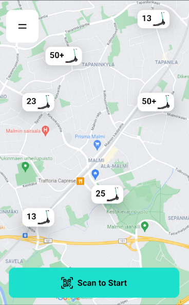
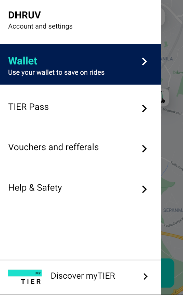
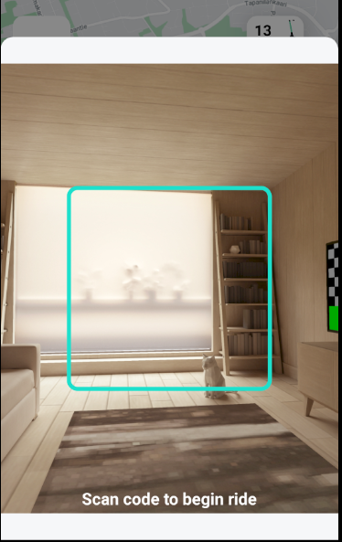

COMMON ERRORS
===================================================
error eslint-visitor-keys@3.0.0: The engine "node" is incompatible with this module. Expected version "^12.22.0 || ^14.17.0 || >=16.0.0". Got "12.18.3"
error Found incompatible module.
info Visit https://yarnpkg.com/en/docs/cli/add for documentation about this command.
C:\Users\dhruv.pandey\Desktop\tier-react-native-clone\tier\node_modules\metro-hermes-compiler\src\emhermesc.js:77
          throw ex;
          ^

RuntimeError: abort(Error: Command failed: yarn add -D @babel/core @babel/runtime @react-native-community/eslint-config eslint jest babel-jest metro-react-native-babel-preset react-test-renderer@17.0.2). Build with -s ASSERTIONS=1 for more info.

fix: let the project get created. Do "yarn upgrade" after that, so that the modules are updated.

Git steps
===================================================
git init -b main git remote add origin https://github.com/pdhruv93/tier-clone.git git add . && git commit -m "initial commit" && git push git push origin main
